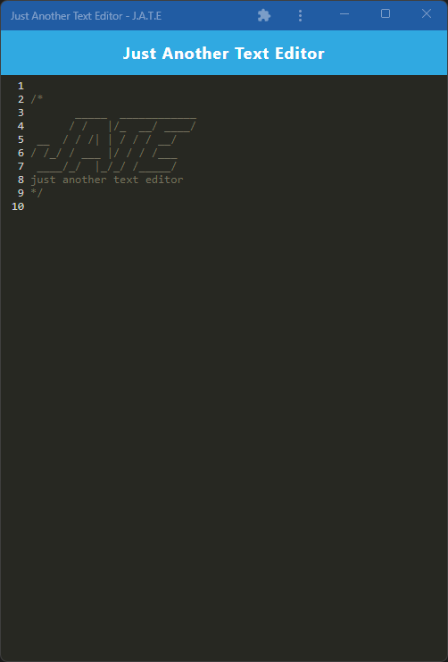

# pwa-text-editor
This app is a single page application that can run both on and offline using an IndexedDB database and can be downloaded to run outside of the browser.

## Description

This application is a simple text editor that stores data in an indexedDB and can be locally installed.  
[Link to Deployed App](https://afternoon-bastion-22644.herokuapp.com/)
          
## Table of Contents

* [Installation](#installation)
* [Usage](#usage)
* [License](#license)
* [Contributions](#contributions)
* [Tests](#tests)
* [Questions](#questions)
          
## Installation

npm install, npm run build, npm run start:dev
          
## Usage

This application has a bonus of JS syntax highlighting but can also be used as a normal text editor.
          
## License

  
undefined
  
undefined 
    
          
## Contributions

no guidlines
          
## Tests

no tests
          
## Questions
If you have any questions you can find my contact info below.
* GitHub: [PeteChicchetti](https://github.com/PeteChicchetti)
* E-mail: petechicchetti@gmail.com